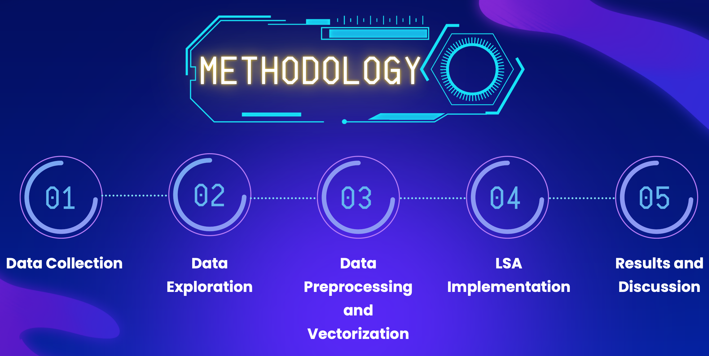

# Analysis of Cloud Computig Articles Using Latent Semantic Analysis

<h1 style="color:#FF6600; background-color:#000080; border: 1px solid #ffffff; padding: 10px 0;">ABSTRACT</h1>

This initiative aims to unveil underlying patterns within the abstracts of Springer articles, specifically those published in the Journal of Cloud Computing. The process involves initial tokenization and lemmatization of the abstracts. Subsequently, a term-document matrix will be generated using TF-IDF, where rows represent individual article abstracts and columns signify words present in the corpus. The next step involves extracting SVD components from this matrix, with the first 5 singular vectors shedding light on the primary 5 topics that encapsulate the essence of the corpus.

Following a meticulous analysis, the top 5 identified topics are as follows: Cloud Computing Efficiency, the Emergence of Edge Computing in China, Blockchain Integration in Cloud Services, Security Threats in Cloud Environments, and Overall Cloud Security. To sum up, the thematic landscape of Cloud Computing articles for the year 2023 revolves prominently around efficiency enhancement, the rise of edge computing, and the paramount importance of security measures.

Based on the results of this project, the recommendations are to use a bigger dataset, consider including cloud vendor-specific articles, try other dimensionality reduction techniques like LDA and NMF, and try using word embedding models like GloVe or Word2Vec.

<h1 style="color:#FF6600; background-color:#000080; border: 1px solid #ffffff; padding: 10px 0;">LIST OF TABLES AND FIGURES</h1>

**TABLES**

- Table 1: Raw Springer Data Sample
- Table 2: Expected DataFrame
- Table 3: Term-document matrix with min_df=0
- Table 4: Term-document matrix with min_df=1% of corpus
- Table 5: Term-document matrix with min_df=3% of corpus

**FIGURES**
- Figure 1: Methodology
- Figure 2: Most commonly occurring words in the corpus
- Figure 3: Retained words versus min_df
- Figure 4: Variance Explained and Cumulative Variance Explained
- Figure 5: Cloud Computing Efficiency
- Figure 6: Edge Computing Prevalence in China
- Figure 7: Blockchain on the Cloud
- Figure 8: Malicious Attacks on the Cloud
- Figure 9: General Cloud Security
- Figure 10: Springer Dataset on first 2 SV's

<h1 style="color:#FF6600; background-color:#000080;border: 1px solid #ffffff; padding: 10px 0;">PRELIMINARIES</h1>

### What Is Latent Semantic Analysis?

"Latent Semantic Analysis (LSA) is an application of the SVD method to the text domain. In this case, the data matrix $D$ is an $n \times d$ document-term matrix containing normalized word frequencies in the $n$ documents, where $d$ is the size of the lexicon. No mean centering is used, but the results are approximately the same as PCA because of the sparsity of $D$. The sparsity of $D$ implies that most of the entries in $D$ or 0, and the mean values of each column are much smaller than the nonzero values." (Aggarwal, 2016)

#### Enhanced Performance
Within the text domain, the reduction in dimensionality achieved through LSA is notably significant. As an illustration, it's common to represent a lexicon-based corpus initially comprising 100,000 dimensions in a concise format of fewer than 300 dimensions.

LSA serves as a classic demonstration showcasing how the deliberate "loss" of information by discarding certain dimensions can remarkably enhance the quality of data representation.

#### Synonymy and Polysemy Challenges
The text domain grapples with two primary challenges: synonymy and polysemy. Synonymy denotes the existence of multiple words sharing the same meaning, while polysemy refers to instances where identical-looking words possess different meanings. This is the underlying reason why similarity-based applications often encounter inaccuracies.

LSA  stands out for its ability to effectively alleviate the disruptive effects of synonymy and polysemy, consequently refining the accuracy of text-based applications.

<h1 style="color:#FF6600; background-color:#000080; border: 1px solid #ffffff; padding: 10px 0;">PROBLEM STATEMENT</h1>

Springer.com is the official website for Springer, a leading global scientific, technical, and medical publisher. The website provides access to a wide range of academic and professional content, including books, journals, and reference works. Users can search for and purchase publications, access online resources, and stay updated on the latest research and developments in their field of interest.

This project aims to uncover latent features in the abstracts of articles in Springer’s Journal of Cloud Computing. In practical applications, this helps create better recommendations for researchers and private entities who want to be at the forefront of Cloud Computing. With LSA, we can identify documents that might not look related to the topic on a surface level but turn out to have a deeper relationship.

<h1 style="color:#FF6600; background-color:#000080; border: 1px solid #ffffff; padding: 10px 0;">SIGNIFICANCE OF THE STUDY</h1>

[Gartner Forecasts Worldwide Public Cloud End-User Spending to Reach Nearly $600 Billion in 2023](https://www.gartner.com/en/newsroom/press-releases/2023-04-19-gartner-forecasts-worldwide-public-cloud-end-user-spending-to-reach-nearly-600-billion-in-2023).[2] Companies are quickly moving from purely on-premise systems to an either partial or pure cloud-based existence. Just like any other discipline, trends in cloud computing research change rapidly as the business landscape constantly shifts. As consultants and strategists, we can use these results to help direct the cloud investments of companies towards subtopics that matter right now.

Figure 1: Methodology

1. Gather dataset comprising of Springer article metadata and an exemplar coming from a different source. 
2. Tokenize and lemmatize the abstract and the chosen exemplar.
3. Create matrix where features are **tokens in the documents** and rows are the abstracts of the articles.
4. Apply TF-IDF to the matrix in order to deemphasize frequently occurring words like "a", "and", "the", etc.
5. Apply truncated SVD on the document-term matrix.
6. Identify top 5 topics.
7. Evaluate the performance by interpreting the feature weights and cross-checking with domain knowledge.

<h1 style="color:#FF6600; background-color:#000080;border: 1px solid #ffffff; padding: 10px 0;">CONCLUSION</h1>
It looks like in the year 2023, we're all about efficient, secure, and fast computing--whether it be on the edge or otherwise. Researchers are looking to find an intersection between blockchain technology and increased efficienct, 

* In the year 2023, we're all about efficient, secure, and fast computing. Researchers are constantly looking for ways to improve existing cloud architecture.
* Edge computing is becoming an increasingly popular technology because of increased processing speed, and volumes. Additionally, because data is being processed locally, there is a cost reduction in terms of processing and storage.
* China is taking the lead especially with leveraging edge technology.
* Researchers are finding intersections between blockchain technology and the cloud. We can probably expect Edge computing and blockchain to have some kind of synergy in the future.
* Cloud security is becoming an increasing concern, especially as more public and private entities start migrating sensitive data to the cloud.

Based on the results, it seems that the top 5 topics are the following:

| Topic Number | Title | Description |
| --------------- | --------------- | --------------- |
| 1 | Cloud Computing Efficiency   | Some key terms here are clustering, decentralized, cryptographic, and container. All these point to potential improvements in cloud computing in terms of efficiency.    |
| 2 | Edge Computing Prevalence in China    | Based on manual annotation, it can be verified by the team that a lot of the articles indeed talk about Edge Computing and how it is used to improve services in China.    |
| 3 | Blockchain on the Cloud    | This is somewhat related to topic 1, wherein articles speak of decentralization in Cloud Computing. Blockchain is one of the technologies that enables decentralization.    |
| 4 | Malicious attacks on the cloud   | One of the forefronts of cloud computing research is on how to analyze and thwart attack vectors.    |
| 5 | General Cloud Security    | This is in connection with Topic 4 -- we are seeing articles that speak of encryption improvement.    |

<h1 style="color:#FF6600; background-color:#000080;border: 1px solid #ffffff; padding: 10px 0;">RECOMMENDATIONS</h1>
To take this study forward, the following can be done:

1. Use a bigger dataset. It might be worth looking at other academic websites like [Science Direct](https://sciencedirect.com) for cloud computing articles in order to enhance the corpus.
2. Consider including vendor-specific articles to identify key trends for each.
3. Try other dimensionality reduction techniques like Non-negative Matrix Factorization (NMF) and Latent Dirichlet Allocation (LDA).
4. Try using word embedding models like GloVe or Word2Vec.
5. Perform some clustering method on the data such as K-means.

<h1 style="color:#FF6600; background-color:#000080;border: 1px solid #ffffff; padding: 10px 0;">REFERENCES</h1>

[[1] Aggarwal, C. C. (2015). Data Mining: The textbook. Springer.](https://link.springer.com/book/10.1007/978-3-319-14142-8)

[[2] Gartner. (2023, April 19). Gartner Forecasts Worldwide Public Cloud End-User Spending to Reach Nearly $600 Billion in 2023. Gartner Newsroom.](https://www.gartner.com/en/newsroom/press-releases/2023-04-19-gartner-forecasts-worldwide-public-cloud-end-user-spending-to-reach-nearly-600-billion-in-2023)